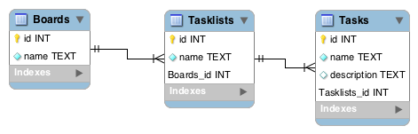

# Boardwalk-API

Ruby on Rails backend for
[Boardwalk](https://github.com/mark1ad/boardwalk).

Development was done using TDD with the built-in Rails test mechanisms.
To execute the tests run
```
rails test_helper
```

---

## Database Design



---

## Routes

Only non-standard routes are listed.

### Tasklists

**GET /boards/1/tasklists<br>
GET /boards/1/tasklists/1**

**POST /boards/1/tasklists**

Parameters |
---------- | -------------
name | name of the tasklist

**PUT /boards/1/tasklists/1**

Parameters |
---------- | -------------
name | name of the tasklist

**DELETE /boards/1/tasklists/1**

### Tasks

**GET /boards/1/tasklists/1/tasks<br>
GET /boards/1/tasklists/1/tasks/1**

**POST /boards/1/tasklists/1/tasks**<br>

Parameters |
---------- | -------------
name | name of the task
description | description of task

**PUT /boards/1/tasklists/1/tasks**<br>

Parameters |
---------- | -------------
name | name of the task
description | description of task

**DELETE /boards/1/tasklists/1/tasks **
